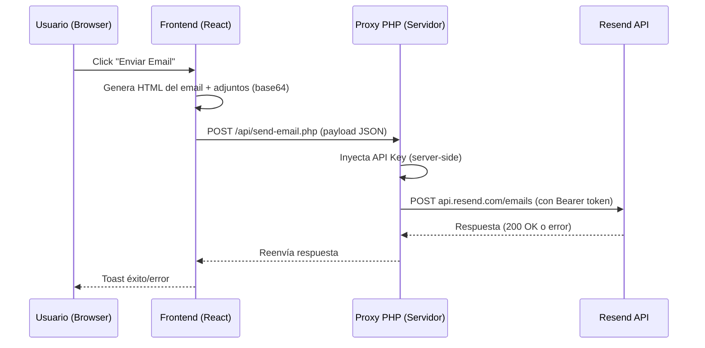
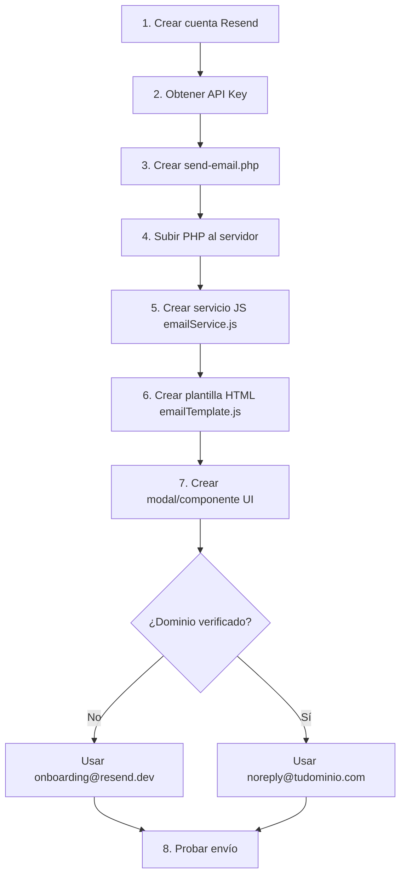

# AG — Guía de Integración Resend para Envío de Emails

> [!IMPORTANT]
> Esta guía documenta el patrón de implementación de **Resend** usado en ERPCubox.
> Sirve como referencia para replicar la funcionalidad de envío de correos en otros proyectos (ej: SJM).

---

## 1. Visión General de la Arquitectura



### ¿Por qué un Proxy PHP?

La API Key de Resend **NUNCA debe exponerse en el frontend**. El proxy server-side (PHP en Hostinger) actúa como intermediario:
- El frontend NO conoce la API Key
- El PHP inyecta el header `Authorization: Bearer <API_KEY>` antes de reenviar a Resend
- CORS está habilitado para permitir llamadas desde el frontend

---

## 2. Componentes del Sistema (4 archivos)

| # | Archivo | Capa | Función |
|---|---------|------|---------|
| 1 | `public/api/send-email.php` | **Backend/Proxy** | Recibe payload del frontend, inyecta API Key, reenvía a Resend |
| 2 | `src/services/invoiceEmailService.js` | **Servicio Frontend** | Función `sendInvoiceEmail()` que llama al proxy |
| 3 | `src/services/invoiceEmailTemplate.js` | **Template HTML** | Genera el cuerpo HTML responsive del email |
| 4 | `src/components/billing/EnviarFacturaEmailModal.jsx` | **UI Modal** | Formulario: destinatario, asunto, mensaje, adjuntos |

---

## 3. Archivo 1: Proxy PHP (Backend — Server-Side)

> [!CAUTION]
> Este archivo se despliega en el servidor web (Hostinger). La API Key está aquí, **NO** en el frontend.

### Ubicación: `public/api/send-email.php`

```php
<?php
/**
 * Proxy para enviar emails vía Resend API
 * POST /api/send-email.php
 * Body: { to, subject, html, from_name, from_email, attachments }
 */

// Permitir CORS
header('Content-Type: application/json');
header('Access-Control-Allow-Origin: *');
header('Access-Control-Allow-Methods: POST, OPTIONS');
header('Access-Control-Allow-Headers: Content-Type, Authorization');

// Manejar preflight OPTIONS
if ($_SERVER['REQUEST_METHOD'] === 'OPTIONS') {
    http_response_code(200);
    exit;
}

if ($_SERVER['REQUEST_METHOD'] !== 'POST') {
    http_response_code(405);
    echo json_encode(['error' => 'Method not allowed']);
    exit;
}

// ─── CONFIGURACIÓN ─────────────────────────────────────────────
// API Key de Resend - https://resend.com/api-keys
$RESEND_API_KEY = 're_XXXXXXXXXXXXXXXXXXXXXXXXXXXXXXXXX';  // ← TU API KEY AQUÍ

// ─── Leer body ─────────────────────────────────────────────────
$input = json_decode(file_get_contents('php://input'), true);

if (!$input || !$input['to'] || !$input['subject'] || !$input['html']) {
    http_response_code(400);
    echo json_encode(['error' => 'Faltan campos requeridos: to, subject, html']);
    exit;
}

// ─── Construir payload para Resend ─────────────────────────────
$fromName  = $input['from_name']  ?? 'Mi Organización';
$fromEmail = $input['from_email'] ?? 'onboarding@resend.dev'; 

$payload = [
    'from' => "$fromName <$fromEmail>",
    'to'   => is_array($input['to']) ? $input['to'] : [$input['to']],
    'subject' => $input['subject'],
    'html'    => $input['html']
];

// Adjuntos (base64)
if (!empty($input['attachments'])) {
    $payload['attachments'] = $input['attachments'];
}

// ─── Llamar a Resend API ───────────────────────────────────────
$ch = curl_init('https://api.resend.com/emails');
curl_setopt_array($ch, [
    CURLOPT_RETURNTRANSFER => true,
    CURLOPT_POST           => true,
    CURLOPT_POSTFIELDS     => json_encode($payload),
    CURLOPT_HTTPHEADER     => [
        'Content-Type: application/json',
        "Authorization: Bearer $RESEND_API_KEY"
    ],
    CURLOPT_TIMEOUT => 30
]);

$response = curl_exec($ch);
$httpCode = curl_getinfo($ch, CURLINFO_HTTP_CODE);
$curlError = curl_error($ch);
curl_close($ch);

if ($curlError) {
    http_response_code(500);
    echo json_encode(['error' => "Error de conexión: $curlError"]);
    exit;
}

http_response_code($httpCode);
echo $response;
```

### Puntos Clave del Proxy:

| Aspecto | Detalle |
|---------|---------|
| **API Key** | Hardcoded en el PHP (nunca llega al browser) |
| **CORS** | `Access-Control-Allow-Origin: *` para que funcione desde cualquier dominio |
| **Preflight** | Maneja `OPTIONS` devolviendo `200` (requerido por browsers) |
| **Adjuntos** | Se reenvían tal cual (array de `{filename, content}` con content en base64) |
| **`from`** | Formato Resend: `"Nombre <email@dominio.com>"` |

---

## 4. Archivo 2: Servicio Frontend (JavaScript)

### Ubicación: `src/services/emailService.js`

```javascript
/**
 * Email Service
 * Envía correos electrónicos a través de Resend (vía proxy PHP)
 */

const EMAIL_API_URL = '/api/send-email.php';

/**
 * Envía un email con adjuntos opcionales
 * @param {Object} params
 * @param {string} params.to          - Email del destinatario
 * @param {string} params.subject     - Asunto del correo
 * @param {string} params.html        - HTML del cuerpo del email
 * @param {string} [params.fromName]  - Nombre del remitente
 * @param {string} [params.fromEmail] - Email del remitente (requiere dominio verificado)
 * @param {Array}  [params.attachments] - Adjuntos [{filename, content (base64)}]
 * @returns {Promise<Object>}
 */
export const sendEmail = async ({ to, subject, html, fromName, fromEmail, attachments }) => {
    try {
        const payload = {
            to,
            subject,
            html,
            from_name: fromName,
            from_email: fromEmail
        };

        if (attachments && attachments.length > 0) {
            payload.attachments = attachments;
        }

        const response = await fetch(EMAIL_API_URL, {
            method: 'POST',
            headers: { 'Content-Type': 'application/json' },
            body: JSON.stringify(payload)
        });

        const data = await response.json();

        if (!response.ok) {
            throw new Error(data.error || data.message || `Error ${response.status} al enviar email`);
        }

        return data;
    } catch (error) {
        console.error('Error sending email:', error);
        throw error;
    }
};

export default sendEmail;
```

---

## 5. Archivo 3: Plantilla HTML del Email

### Ubicación: `src/services/emailTemplate.js`

> [!TIP]
> Los clientes de email (Gmail, Outlook, Apple Mail) requieren HTML con **tablas** (`<table>`) para layout.
> CSS moderno (flexbox, grid) **NO funciona** en emails. Usar inline styles siempre.

```javascript
/**
 * Plantilla de Email Corporativo — Tema Claro con acento azul
 * 
 * @param {Object} params
 * @param {string} params.orgName       - Nombre de la organización
 * @param {string} [params.logoUrl]     - URL del logo
 * @param {string} params.recipientName - Nombre del destinatario
 * @param {string} params.title         - Título principal del email (ej: "Confirmación de Inscripción")
 * @param {string} params.bodyContent   - Contenido HTML del cuerpo
 * @param {string} [params.footerInfo]  - Dirección/teléfono para el footer
 * @returns {string} HTML completo del email
 */
export const buildEmailHTML = ({ orgName, logoUrl, recipientName, title, bodyContent, footerInfo }) => {
    const primaryColor = '#1e40af';
    const primaryLight = '#3b82f6';
    const bgColor = '#f3f4f6';
    const cardBg = '#ffffff';
    const textDark = '#1f2937';
    const textMuted = '#6b7280';
    const borderColor = '#e5e7eb';

    return `
<!DOCTYPE html>
<html lang="es">
<head>
    <meta charset="UTF-8">
    <meta name="viewport" content="width=device-width, initial-scale=1.0">
    <title>${title} - ${orgName}</title>
</head>
<body style="margin: 0; padding: 0; background-color: ${bgColor}; font-family: 'Segoe UI', Tahoma, Geneva, Verdana, sans-serif;">
    
    <table role="presentation" cellpadding="0" cellspacing="0" width="100%" style="background-color: ${bgColor};">
        <tr>
            <td align="center" style="padding: 30px 15px;">
                
                <!-- Card principal -->
                <table role="presentation" cellpadding="0" cellspacing="0" width="600" 
                       style="max-width: 600px; width: 100%; background-color: ${cardBg}; 
                              border-radius: 12px; overflow: hidden; 
                              box-shadow: 0 2px 12px rgba(0,0,0,0.08); 
                              border: 1px solid ${borderColor};">
                    
                    <!-- Header con gradiente -->
                    <tr>
                        <td style="background: linear-gradient(135deg, ${primaryColor} 0%, ${primaryLight} 100%); padding: 0;">
                            <table role="presentation" cellpadding="0" cellspacing="0" width="100%">
                                <tr>
                                    <td style="padding: 24px 32px;" valign="middle">
                                        ${logoUrl 
                                            ? ``
                                            : `<div style="width: 56px; height: 56px; background: rgba(255,255,255,0.2); border-radius: 10px; display: inline-block;"></div>`
                                        }
                                    </td>
                                    <td style="padding: 24px 32px; text-align: right;" valign="middle">
                                        <h1 style="margin: 0; color: #ffffff; font-size: 20px; font-weight: 700;">${title}</h1>
                                    </td>
                                </tr>
                            </table>
                        </td>
                    </tr>

                    <!-- Nombre de organización -->
                    <tr>
                        <td style="padding: 20px 32px 0; text-align: center;">
                            <p style="margin: 0; color: ${primaryColor}; font-size: 16px; font-weight: 700;">${orgName}</p>
                        </td>
                    </tr>

                    <!-- Saludo + Contenido -->
                    <tr>
                        <td style="padding: 20px 32px 24px;">
                            <p style="margin: 0 0 12px; color: ${textDark}; font-size: 15px;">
                                Estimado/a <strong>${recipientName || 'participante'}</strong>,
                            </p>
                            <div style="color: ${textMuted}; font-size: 14px; line-height: 1.7;">
                                ${bodyContent}
                            </div>
                        </td>
                    </tr>

                    <!-- Divider -->
                    <tr>
                        <td style="padding: 0 32px;">
                            <hr style="border: none; border-top: 1px solid ${borderColor};" />
                        </td>
                    </tr>

                    <!-- Footer -->
                    <tr>
                        <td style="padding: 24px 32px;">
                            <p style="margin: 0; color: ${textMuted}; font-size: 12px; line-height: 1.6;">
                                <strong style="color: ${textDark};">${orgName}</strong><br />
                                ${footerInfo || ''}<br />
                            </p>
                            <p style="margin: 8px 0 0; color: #9ca3af; font-size: 11px;">
                                Este correo fue generado automáticamente. No responda a este mensaje.<br />
                                © ${new Date().getFullYear()} ${orgName}
                            </p>
                        </td>
                    </tr>
                </table>

            </td>
        </tr>
    </table>
</body>
</html>`;
};

export default buildEmailHTML;
```

---

## 6. Archivo 4: Componente UI (Modal de Envío)

### Ubicación: `src/components/EnviarEmailModal.jsx`

El modal incluye:
- Campo **Para** (pre-llenado si se tiene el email del destinatario)
- Campo **Asunto** (pre-llenado con contexto)
- **Mensaje personalizado** (textarea opcional)
- **Checkboxes de adjuntos** (PDF, XML, u otros)
- Botones **Cancelar** y **Enviar**

> [!NOTE]
> El componente del modal en ERPCubox está en `src/components/billing/EnviarFacturaEmailModal.jsx`.
> Se adaptaría según las necesidades del proyecto SJM (ej: confirmaciones de inscripción, recibos de donación, etc.).

---

## 7. Configuración de Resend (Paso a Paso)

### 7.1 Crear Cuenta en Resend

1. Ir a [resend.com](https://resend.com)
2. Crear cuenta (puede ser con GitHub o Google)
3. Obtener la **API Key** desde [resend.com/api-keys](https://resend.com/api-keys)
4. El formato es: `re_XXXXXXXXXXXXXXXXXXXXXXXXXXXXXXXXX`

### 7.2 Configurar Remitente (`from`)

| Situación | Email de remitente | Requisito |
|-----------|-------------------|-----------|
| **Sin dominio verificado** | `onboarding@resend.dev` | Ninguno (funciona inmediatamente) |
| **Con dominio verificado** | `noreply@tudominio.com` | Verificar dominio en Resend Dashboard |

### 7.3 Verificar Dominio Propio (Opcional pero Recomendado)

1. Ir a [resend.com/domains](https://resend.com/domains)
2. Agregar tu dominio (ej: `sjm.org.mx`)
3. Resend te dará **3 registros DNS** para agregar:
   - **MX** record
   - **SPF** (TXT record)
   - **DKIM** (TXT record)
4. Agregar estos registros en tu panel DNS (Hostinger, Cloudflare, GoDaddy, etc.)
5. Esperar verificación (puede tomar de minutos a 48 horas)
6. Una vez verificado, puedes usar cualquier dirección `@tudominio.com` como remitente

> [!WARNING]
> **Sin verificar el dominio**, Resend rechaza emails enviados desde direcciones de ese dominio.
> Error típico: `"The tudominio.com domain is not verified"`
> **Solución temporal:** Usar `onboarding@resend.dev` como `from_email`.

### 7.4 Límites del Plan Gratuito

| Límite | Valor |
|--------|-------|
| Emails por día | 100 |
| Emails por mes | 3,000 |
| Dominios | 1 |
| API Keys | Ilimitadas |
| Adjuntos | Sí (hasta 40MB total por email) |

---

## 8. Formato de Adjuntos

Resend acepta adjuntos en **base64**. El formato del array es:

```javascript
const attachments = [
    {
        filename: 'documento.pdf',
        content: 'JVBERi0xLjQKMSAwI...'  // base64 string (SIN el prefijo data:)
    },
    {
        filename: 'datos.xml',
        content: 'PD94bWwgdmVyc2lv...'  // base64 string
    }
];
```

### Cómo convertir archivos a base64:

```javascript
// Desde un Blob/File
const fileToBase64 = (file) => new Promise((resolve) => {
    const reader = new FileReader();
    reader.onload = () => resolve(reader.result.split(',')[1]); // quitar prefijo
    reader.readAsDataURL(file);
});

// Desde texto plano (ej: XML string)
const textToBase64 = (text) => btoa(unescape(encodeURIComponent(text)));
```

---

## 9. Flujo Completo de Implementación para SJM



### Casos de Uso para SJM:
| Evento | Asunto sugerido | Adjuntos |
|--------|----------------|----------|
| Confirmación de inscripción a evento | `Confirmación — Diplomado XYZ` | Comprobante PDF |
| Recibo de donación/aportación | `Recibo de Aportación — SJM` | Recibo PDF |
| Notificación de nuevo evento | `Nuevo Evento — SJM` | Ninguno |
| Recordatorio de evento | `Recordatorio — Mañana: Taller XYZ` | Ninguno |

---

## 10. Troubleshooting — Errores Comunes

| Error | Causa | Solución |
|-------|-------|----------|
| `"domain is not verified"` | El `from_email` usa un dominio no verificado en Resend | Verificar dominio en [resend.com/domains](https://resend.com/domains) o usar `onboarding@resend.dev` |
| `403 Forbidden` en el fetch | CORS bloqueado o ruta incorrecta al PHP | Verificar headers CORS en el PHP y que la URL sea correcta |
| `405 Method Not Allowed` | El request no es POST | Verificar que el frontend envíe `method: 'POST'` |
| `curl_error` en PHP | El servidor no puede conectar a `api.resend.com` | Verificar que el hosting permita conexiones salientes HTTPS |
| `401 Unauthorized` | API Key inválida o expirada | Regenerar en [resend.com/api-keys](https://resend.com/api-keys) |
| Email cae en Spam | Dominio no verificado o sin registros SPF/DKIM | Verificar dominio y configurar DNS correctamente |
| Adjunto vacío / corrupto | Base64 incorrecto (incluye prefijo `data:`) | Asegurarse de enviar solo el contenido base64, sin `data:application/pdf;base64,` al inicio |

---

## 11. Referencia Rápida — API de Resend

### Endpoint
```
POST https://api.resend.com/emails
```

### Headers
```
Content-Type: application/json
Authorization: Bearer re_XXXXXXXXX
```

### Body (JSON)
```json
{
    "from": "Nombre <email@dominio.com>",
    "to": ["destinatario@email.com"],
    "subject": "Asunto del correo",
    "html": "<h1>Hola</h1><p>Contenido HTML</p>",
    "attachments": [
        {
            "filename": "archivo.pdf",
            "content": "base64string..."
        }
    ]
}
```

### Respuesta exitosa (200)
```json
{
    "id": "abc123-uuid-del-email"
}
```

### Documentación oficial
- API: [resend.com/docs/api-reference](https://resend.com/docs/api-reference/emails/send-email)
- Dominios: [resend.com/docs/dashboard/domains](https://resend.com/docs/dashboard/domains/introduction)

---

> **Archivos fuente de referencia (ERPCubox):**
> - Proxy PHP: `public/api/send-email.php`
> - Servicio: `src/services/invoiceEmailService.js`
> - Template: `src/services/invoiceEmailTemplate.js`
> - Modal UI: `src/components/billing/EnviarFacturaEmailModal.jsx`
