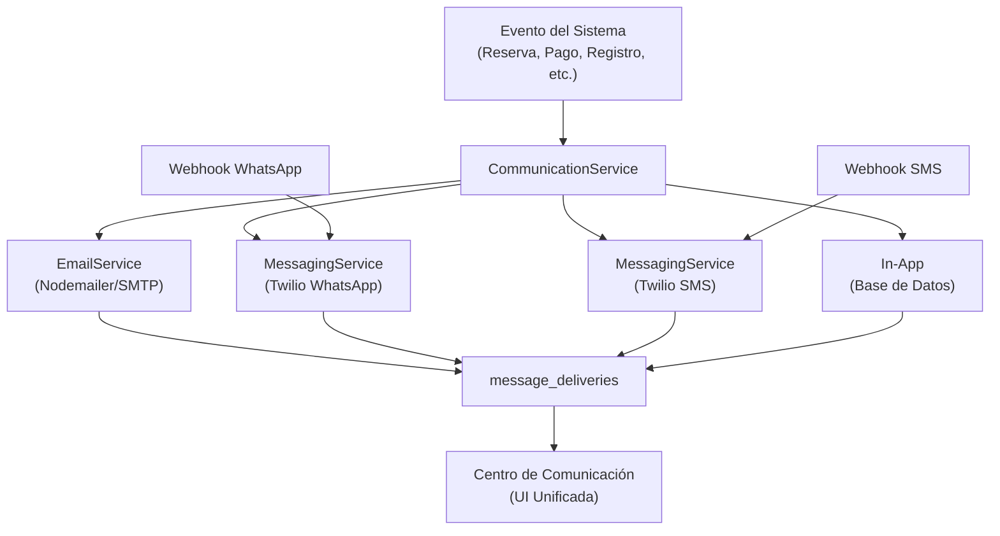
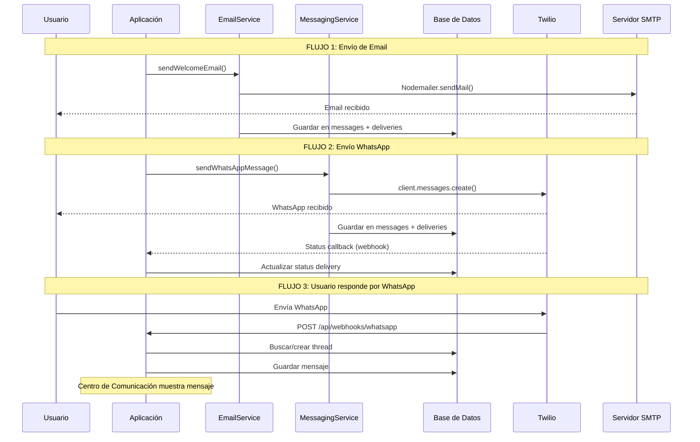

# 📧📱 Guía de Implementación: Sistema de WhatsApp y Correos

**Basado en:** Proyecto AS Operadora (operadora-dev)  
**Objetivo:** Replicar la arquitectura en un nuevo proyecto (ej. SJM u otro Next.js + Supabase)  
**Fecha:** 9 de Abril de 2026

---

## 📋 Índice

1. [Resumen de la Arquitectura](#1-resumen-de-la-arquitectura)
2. [PARTE 1: Sistema de Correos (Email)](#parte-1-sistema-de-correos)
3. [PARTE 2: Sistema de WhatsApp + SMS (Twilio)](#parte-2-sistema-de-whatsapp--sms)
4. [PARTE 3: Centro de Comunicación Unificado](#parte-3-centro-de-comunicación-unificado)
5. [PARTE 4: Cómo Replicar en Otro Proyecto](#parte-4-cómo-replicar-en-otro-proyecto)

---

## 1. Resumen de la Arquitectura



### Componentes Principales

| Componente | Tecnología | Propósito |
|-----------|-----------|-----------|
| **Email** | Nodemailer + SMTP | Correos transaccionales |
| **WhatsApp** | Twilio WhatsApp API | Mensajería bidireccional |
| **SMS** | Twilio SMS API | Verificaciones y alertas |
| **Centro de Comunicación** | Next.js + PostgreSQL | UI unificada de todos los canales |

---

# PARTE 1: Sistema de Correos

## 1.1 Estructura de Archivos Creada

```
src/
├── services/
│   ├── EmailService.ts              # Servicio de envío con Nodemailer
│   ├── EmailTemplateService.ts      # Motor de renderizado de templates
│   └── CommunicationService.ts      # Registro de envíos en BD
├── lib/
│   ├── emailHelper.ts               # 14 funciones helper de alto nivel
│   └── itineraryNotifications.ts    # Notificaciones de cambios
├── templates/
│   └── email/
│       ├── base-template.html       # Template base (header + footer)
│       ├── welcome.html             # Bienvenida
│       ├── booking-confirmed.html   # Confirmación reserva
│       ├── payment-confirmed.html   # Confirmación pago
│       ├── quote-sent.html          # Cotización
│       ├── password-reset.html      # Recuperar contraseña
│       ├── email-verification.html  # Verificar email
│       └── ...                      # 14 templates en total
├── cron/
│   └── email-reminders.ts          # Cron jobs automáticos
└── app/api/
    ├── auth/
    │   ├── forgot-password/route.ts
    │   ├── reset-password/route.ts
    │   ├── verify-email/route.ts
    │   └── resend-verification/route.ts
    ├── bookings/
    │   └── notify-change/route.ts
    └── cron/
        └── email-reminders/route.ts
```

## 1.2 Paso 1: EmailService (Capa de Transporte)

> [!IMPORTANT]
> Este es el servicio de bajo nivel que conecta con el servidor SMTP. Todo envío de correo pasa por aquí.

**Archivo:** `src/services/EmailService.ts`

```typescript
import nodemailer from 'nodemailer';

class EmailServiceClass {
  private transporter: nodemailer.Transporter;

  constructor() {
    this.transporter = nodemailer.createTransport({
      host: process.env.SMTP_HOST,
      port: parseInt(process.env.SMTP_PORT || '587'),
      secure: process.env.SMTP_PORT === '465', // true para 465, false para otros
      auth: {
        user: process.env.SMTP_USER,
        pass: process.env.SMTP_PASS,
      },
    });
  }

  async sendEmail(options: {
    to: string;
    subject: string;
    html: string;
    text?: string;
    attachments?: any[];
  }): Promise<boolean> {
    try {
      const info = await this.transporter.sendMail({
        from: `"${process.env.EMAIL_FROM_NAME || 'Mi App'}" <${process.env.SMTP_USER}>`,
        to: options.to,
        subject: options.subject,
        html: options.html,
        text: options.text,
        attachments: options.attachments,
      });
      
      console.log('✅ Email enviado:', info.messageId);
      return true;
    } catch (error) {
      console.error('❌ Error enviando email:', error);
      return false;
    }
  }
}

export const emailService = new EmailServiceClass();
```

### Variables de Entorno Necesarias

```bash
# .env.local
SMTP_HOST=mail.tudominio.com      # o smtp.gmail.com para Gmail
SMTP_PORT=465                      # 465 para SSL, 587 para TLS
SMTP_USER=noreply@tudominio.com
SMTP_PASS=tu_contraseña
EMAIL_FROM_NAME=Mi Aplicación
```

> [!TIP]
> **Alternativa con Resend (usado en ERPCubox):** Si prefieres una API más moderna en lugar de SMTP, puedes usar [Resend](https://resend.com) con un proxy PHP. En AS Operadora se eligió Nodemailer por tener hosting SMTP propio (SiteGround).

## 1.3 Paso 2: Template Base HTML

> [!NOTE]
> El sistema usa templates HTML con variables tipo `{{VARIABLE}}`. Un template base define header y footer, y cada template específico define el contenido.

**Archivo:** `src/templates/email/base-template.html`

```html
<!DOCTYPE html>
<html>
<head>
  <meta charset="utf-8">
  <meta name="viewport" content="width=device-width, initial-scale=1.0">
  <style>
    /* Reset para clientes de email */
    body { margin: 0; padding: 0; font-family: -apple-system, Segoe UI, sans-serif; }
    .container { max-width: 600px; margin: 0 auto; background: #ffffff; }
    
    /* Header */
    .header { 
      background: linear-gradient(135deg, #f8f9fa 0%, #ffffff 50%, #e8f0fe 100%);
      padding: 30px 30px 20px;
      text-align: center;
      border-bottom: 1px solid #e5e7eb;
    }
    .logo-text { font-family: Georgia, serif; font-size: 40px; color: #111827; }
    
    /* Content */
    .content { padding: 40px 30px; }
    .highlight-box { 
      background: linear-gradient(135deg, #0066FF, #0052CC);
      color: white;
      padding: 20px;
      border-radius: 12px;
      text-align: center;
    }
    .info-box { 
      background: #f9fafb; 
      border-left: 4px solid #0066FF; 
      padding: 20px; 
      border-radius: 4px; 
    }
    .btn-primary { 
      display: inline-block;
      background: linear-gradient(135deg, #0066FF, #0052CC);
      color: white !important;
      padding: 14px 32px;
      border-radius: 8px;
      text-decoration: none;
      font-weight: 600;
    }
    
    /* Footer */
    .footer { 
      background: #f3f4f6; 
      padding: 15px 30px;
      text-align: center;
      font-size: 12px;
      color: #6b7280;
    }
  </style>
</head>
<body>
  <div class="container">
    <!-- HEADER -->
    <div class="header">
      <div class="logo-text">{{APP_LOGO}}</div>
      <div style="font-size: 10px; color: #6b7280;">{{APP_TAGLINE}}</div>
    </div>
    
    <!-- CONTENT (se inyecta desde cada template) -->
    <div class="content">
      {{CONTENT}}
    </div>
    
    <!-- FOOTER -->
    <div class="footer">
      <div>{{APP_NAME}} | 📧 {{CONTACT_EMAIL}} | 📱 {{CONTACT_PHONE}}</div>
      <div style="margin-top: 8px;">
        <a href="{{UNSUBSCRIBE_URL}}">Cancelar suscripción</a> | 
        <a href="{{PRIVACY_URL}}">Aviso de Privacidad</a> | 
        © {{YEAR}} {{APP_NAME}}
      </div>
    </div>
  </div>
</body>
</html>
```

## 1.4 Paso 3: EmailTemplateService (Motor de Renderizado)

**Archivo:** `src/services/EmailTemplateService.ts`

```typescript
import fs from 'fs';
import path from 'path';

export class EmailTemplateService {
  
  // Renderizar un template con variables
  static renderTemplate(templateName: string, variables: Record<string, any>): string {
    // Leer template base
    const basePath = path.join(process.cwd(), 'src/templates/email/base-template.html');
    let baseHtml = fs.readFileSync(basePath, 'utf-8');
    
    // Leer template específico
    const templatePath = path.join(process.cwd(), `src/templates/email/${templateName}.html`);
    const contentHtml = fs.readFileSync(templatePath, 'utf-8');
    
    // Inyectar contenido en base
    baseHtml = baseHtml.replace('{{CONTENT}}', contentHtml);
    
    // Reemplazar variables globales
    baseHtml = baseHtml
      .replace(/\{\{APP_LOGO\}\}/g, process.env.APP_LOGO || 'MI APP')
      .replace(/\{\{APP_NAME\}\}/g, process.env.APP_NAME || 'Mi Aplicación')
      .replace(/\{\{APP_TAGLINE\}\}/g, process.env.APP_TAGLINE || '')
      .replace(/\{\{CONTACT_EMAIL\}\}/g, process.env.CONTACT_EMAIL || '')
      .replace(/\{\{CONTACT_PHONE\}\}/g, process.env.CONTACT_PHONE || '')
      .replace(/\{\{YEAR\}\}/g, new Date().getFullYear().toString());
    
    // Procesar condicionales: {{#if VAR}}...{{/if}}
    baseHtml = baseHtml.replace(/\{\{#if (\w+)\}\}([\s\S]*?)\{\{\/if\}\}/g, 
      (match, varName, content) => {
        return variables[varName] ? content : '';
      }
    );
    
    // Procesar loops: {{#each ARRAY}}...{{/each}}
    baseHtml = baseHtml.replace(/\{\{#each (\w+)\}\}([\s\S]*?)\{\{\/each\}\}/g,
      (match, arrayName, template) => {
        const items = variables[arrayName];
        if (!Array.isArray(items)) return '';
        return items.map(item => {
          let result = template;
          if (typeof item === 'object') {
            Object.entries(item).forEach(([key, value]) => {
              result = result.replace(new RegExp(`\\{\\{${key}\\}\\}`, 'g'), String(value));
            });
          } else {
            result = result.replace(/\{\{this\}\}/g, String(item));
          }
          return result;
        }).join('');
      }
    );
    
    // Reemplazar variables simples
    Object.entries(variables).forEach(([key, value]) => {
      if (typeof value === 'string' || typeof value === 'number') {
        baseHtml = baseHtml.replace(new RegExp(`\\{\\{${key}\\}\\}`, 'g'), String(value));
      }
    });
    
    return baseHtml;
  }

  // Métodos específicos por tipo de correo
  static renderWelcome(data: { customerName: string; email: string }) {
    const html = this.renderTemplate('welcome', {
      CUSTOMER_NAME: data.customerName,
      EMAIL: data.email,
    });
    return { html, subject: '¡Bienvenido a nuestra plataforma!' };
  }

  static renderPasswordReset(data: { name: string; resetUrl: string; expiryTime: string }) {
    const html = this.renderTemplate('password-reset', {
      CUSTOMER_NAME: data.name,
      RESET_URL: data.resetUrl,
      EXPIRY_TIME: data.expiryTime,
    });
    return { html, subject: 'Recupera tu contraseña' };
  }
  
  // ... más métodos para cada template
}
```

## 1.5 Paso 4: emailHelper (Funciones de Alto Nivel)

> [!TIP]
> Estas funciones son las que se llaman desde los endpoints/flujos. Combinan el renderizado del template + envío + registro en Centro de Comunicación.

**Archivo:** `src/lib/emailHelper.ts`

```typescript
import { emailService } from '@/services/EmailService';
import { EmailTemplateService } from '@/services/EmailTemplateService';

// 1. Bienvenida
export async function sendWelcomeEmail(data: { name: string; email: string }) {
  const { html, subject } = EmailTemplateService.renderWelcome({
    customerName: data.name,
    email: data.email,
  });
  
  const success = await emailService.sendEmail({
    to: data.email,
    subject,
    html,
  });
  
  // Opcional: registrar en Centro de Comunicación
  if (success) {
    await registerEmailDelivery({
      recipient: data.email,
      subject,
      templateName: 'welcome',
      status: 'sent',
    });
  }
  
  return success;
}

// 2. Recuperación de Contraseña
export async function sendPasswordResetEmail(data: {
  name: string;
  email: string;
  resetUrl: string;
  expiryTime: string;
}) {
  const { html, subject } = EmailTemplateService.renderPasswordReset(data);
  return emailService.sendEmail({ to: data.email, subject, html });
}

// 3. Verificación de Email
export async function sendEmailVerificationEmail(data: {
  name: string;
  email: string;
  verificationUrl: string;
  expiryTime: string;
}) {
  const { html, subject } = EmailTemplateService.renderEmailVerification(data);
  return emailService.sendEmail({ to: data.email, subject, html });
}

// ... 14 funciones en total, una por cada template
```

## 1.6 Paso 5: Integración en Flujos (Triggers)

### Ejemplo: Al Registrarse → Enviar Verificación

```typescript
// src/app/api/auth/register/route.ts
import { sendEmailVerificationEmail } from '@/lib/emailHelper';
import crypto from 'crypto';

export async function POST(request: Request) {
  const { name, email, password } = await request.json();
  
  // 1. Crear usuario en BD (email_verified = false)
  const user = await createUser({ name, email, password });
  
  // 2. Generar token de verificación
  const token = crypto.randomBytes(32).toString('hex');
  await saveVerificationToken(user.id, token, /* expira 24h */);
  
  // 3. Enviar email de verificación
  await sendEmailVerificationEmail({
    name: user.name,
    email: user.email,
    verificationUrl: `${process.env.NEXT_PUBLIC_APP_URL}/verify-email?token=${token}`,
    expiryTime: '24 horas',
  });
  
  return Response.json({ success: true });
}
```

### Ejemplo: Recuperación de Contraseña

```typescript
// src/app/api/auth/forgot-password/route.ts
import { sendPasswordResetEmail } from '@/lib/emailHelper';

export async function POST(request: Request) {
  const { email } = await request.json();
  
  // 1. Buscar usuario (respuesta genérica para seguridad)
  const user = await findUserByEmail(email);
  if (!user) {
    return Response.json({ success: true }); // No revelar si existe
  }
  
  // 2. Generar token (expira 1 hora)
  const token = crypto.randomBytes(32).toString('hex');
  await saveResetToken(user.id, token);
  
  // 3. Enviar email
  await sendPasswordResetEmail({
    name: user.name,
    email: user.email,
    resetUrl: `${process.env.NEXT_PUBLIC_APP_URL}/reset-password?token=${token}`,
    expiryTime: '1 hora',
  });
  
  return Response.json({ success: true });
}
```

## 1.7 Paso 6: Cron Jobs para Recordatorios

**Archivo:** `src/cron/email-reminders.ts`

```typescript
import { supabase } from '@/lib/supabase';
import { sendQuoteReminderEmail, sendPreTripReminderEmail } from '@/lib/emailHelper';

export async function processEmailReminders() {
  const results = {
    quoteReminders: 0,
    preTripReminders: 0,
    errors: 0,
  };

  // 1. Recordatorios de cotización (24-48h antes de expirar)
  const { data: expiringQuotes } = await supabase
    .from('quotes')
    .select('*, user:users(*)')
    .eq('reminder_sent', false)
    .eq('status', 'pending')
    .lte('expires_at', new Date(Date.now() + 48 * 60 * 60 * 1000).toISOString())
    .gte('expires_at', new Date().toISOString());

  for (const quote of expiringQuotes || []) {
    try {
      await sendQuoteReminderEmail({ /* datos */ });
      await supabase.from('quotes')
        .update({ reminder_sent: true, reminder_sent_at: new Date().toISOString() })
        .eq('id', quote.id);
      results.quoteReminders++;
    } catch (e) { results.errors++; }
  }

  // 2. Recordatorios pre-evento (7, 3, 1 día antes)
  // ... lógica similar

  return results;
}
```

**Endpoint para Vercel Cron:**
```typescript
// src/app/api/cron/email-reminders/route.ts
import { processEmailReminders } from '@/cron/email-reminders';

export async function GET(request: Request) {
  // Verificar cron secret
  const authHeader = request.headers.get('authorization');
  if (authHeader !== `Bearer ${process.env.CRON_SECRET_KEY}`) {
    return Response.json({ error: 'Unauthorized' }, { status: 401 });
  }
  
  const results = await processEmailReminders();
  return Response.json({ success: true, results });
}
```

**Configurar en `vercel.json`:**
```json
{
  "crons": [
    {
      "path": "/api/cron/email-reminders",
      "schedule": "0 10 * * *"
    }
  ]
}
```

---

# PARTE 2: Sistema de WhatsApp + SMS

## 2.1 Estructura de Archivos

```
src/
├── services/
│   └── MessagingService.ts          # Servicio WhatsApp + SMS
└── app/api/
    ├── messaging/
    │   ├── send/route.ts            # Enviar mensajes
    │   └── conversations/route.ts   # Obtener conversaciones
    └── webhooks/
        ├── whatsapp/route.ts        # Recibir WhatsApp
        ├── sms/route.ts             # Recibir SMS
        └── message-status/route.ts  # Estado de mensajes
```

## 2.2 Paso 1: Configurar Twilio

### Crear Cuenta
1. Ir a [https://www.twilio.com/](https://www.twilio.com/)
2. Crear cuenta gratuita ($15 USD de crédito)
3. Verificar número de teléfono

### Variables de Entorno
```bash
# .env.local
TWILIO_ACCOUNT_SID=ACxxxxxxxxxxxxxxxxxxxxxxxxxxxxxxxx
TWILIO_AUTH_TOKEN=your_auth_token_here
TWILIO_PHONE_NUMBER=+15551234567        # Para SMS
TWILIO_WHATSAPP_NUMBER=+14155238886     # Para WhatsApp (Sandbox)
```

### Instalar SDK
```bash
npm install twilio
```

## 2.3 Paso 2: MessagingService (Servicio Principal)

**Archivo:** `src/services/MessagingService.ts`

```typescript
import twilio from 'twilio';
import { supabase } from '@/lib/supabase';

const client = twilio(
  process.env.TWILIO_ACCOUNT_SID,
  process.env.TWILIO_AUTH_TOKEN
);

// ========== ENVÍO ==========

export async function sendWhatsAppMessage(params: {
  to: string;
  body: string;
  threadId?: number;
  userId?: number;
}) {
  try {
    // Enviar vía Twilio
    const message = await client.messages.create({
      body: params.body,
      from: `whatsapp:${process.env.TWILIO_WHATSAPP_NUMBER}`,
      to: `whatsapp:${params.to}`,
      statusCallback: `${process.env.NEXT_PUBLIC_APP_URL}/api/webhooks/message-status`,
    });

    // Registrar en BD
    if (params.threadId) {
      await saveMessageToThread({
        threadId: params.threadId,
        body: params.body,
        senderType: 'agent',
        messageType: 'whatsapp',
        providerMessageId: message.sid,
      });
    }

    return { success: true, sid: message.sid };
  } catch (error) {
    console.error('Error WhatsApp:', error);
    return { success: false, error };
  }
}

export async function sendSMSMessage(params: {
  to: string;
  body: string;
  threadId?: number;
  userId?: number;
}) {
  try {
    const message = await client.messages.create({
      body: params.body,
      from: process.env.TWILIO_PHONE_NUMBER,
      to: params.to,
      statusCallback: `${process.env.NEXT_PUBLIC_APP_URL}/api/webhooks/message-status`,
    });

    if (params.threadId) {
      await saveMessageToThread({
        threadId: params.threadId,
        body: params.body,
        senderType: 'agent',
        messageType: 'sms',
        providerMessageId: message.sid,
      });
    }

    return { success: true, sid: message.sid };
  } catch (error) {
    console.error('Error SMS:', error);
    return { success: false, error };
  }
}

// ========== RECEPCIÓN ==========

export async function processIncomingMessage(params: {
  from: string;
  body: string;
  channel: 'whatsapp' | 'sms';
  messageSid: string;
}) {
  // 1. Buscar usuario por número de teléfono
  const phone = params.from.replace('whatsapp:', '');
  const { data: user } = await supabase
    .from('users')
    .select('id, name, email')
    .or(`phone.eq.${phone},whatsapp_number.eq.${phone}`)
    .maybeSingle();

  // 2. Buscar o crear hilo de conversación
  let thread;
  const { data: existingThread } = await supabase
    .from('communication_threads')
    .select('*')
    .eq('thread_type', params.channel)
    .eq('client_id', user?.id)
    .eq('status', 'open')
    .order('last_message_at', { ascending: false })
    .limit(1)
    .maybeSingle();

  if (existingThread) {
    thread = existingThread;
  } else {
    const { data: newThread } = await supabase
      .from('communication_threads')
      .insert({
        thread_type: params.channel,
        subject: `Conversación ${params.channel} - ${user?.name || phone}`,
        client_id: user?.id,
        status: 'open',
        priority: 'normal',
      })
      .select()
      .single();
    thread = newThread;
  }

  // 3. Guardar mensaje
  const { data: message } = await supabase
    .from('messages')
    .insert({
      thread_id: thread.id,
      sender_id: user?.id,
      sender_type: 'client',
      sender_name: user?.name || phone,
      body: params.body,
      message_type: params.channel,
      metadata: { twilio_sid: params.messageSid },
    })
    .select()
    .single();

  // 4. Registrar delivery
  await supabase.from('message_deliveries').insert({
    message_id: message.id,
    delivery_method: params.channel,
    recipient: phone,
    status: 'delivered',
    provider: 'twilio',
    provider_message_id: params.messageSid,
    delivered_at: new Date().toISOString(),
  });

  // 5. Actualizar contadores del hilo
  await supabase
    .from('communication_threads')
    .update({
      message_count: thread.message_count + 1,
      unread_count_agent: (thread.unread_count_agent || 0) + 1,
      last_message_at: new Date().toISOString(),
    })
    .eq('id', thread.id);

  return { thread, message };
}

// ========== ESTADO ==========

export async function updateMessageStatus(params: {
  messageSid: string;
  status: string;
}) {
  const statusMap: Record<string, string> = {
    queued: 'queued',
    sent: 'sent',
    delivered: 'delivered',
    read: 'read',
    failed: 'failed',
    undelivered: 'failed',
  };

  const mappedStatus = statusMap[params.status] || params.status;

  await supabase
    .from('message_deliveries')
    .update({
      status: mappedStatus,
      ...(mappedStatus === 'delivered' && { delivered_at: new Date().toISOString() }),
      ...(mappedStatus === 'read' && { read_at: new Date().toISOString() }),
      ...(mappedStatus === 'failed' && { error_message: `Twilio status: ${params.status}` }),
    })
    .eq('provider_message_id', params.messageSid);
}

// ========== HELPERS ==========

async function saveMessageToThread(params: {
  threadId: number;
  body: string;
  senderType: string;
  messageType: string;
  providerMessageId: string;
}) {
  const { data: message } = await supabase
    .from('messages')
    .insert({
      thread_id: params.threadId,
      sender_type: params.senderType,
      body: params.body,
      message_type: params.messageType,
    })
    .select()
    .single();

  await supabase.from('message_deliveries').insert({
    message_id: message.id,
    delivery_method: params.messageType,
    status: 'sent',
    provider: 'twilio',
    provider_message_id: params.providerMessageId,
    sent_at: new Date().toISOString(),
  });
}
```

## 2.4 Paso 3: Webhooks (Recibir Mensajes)

### Webhook WhatsApp

```typescript
// src/app/api/webhooks/whatsapp/route.ts
import { processIncomingMessage } from '@/services/MessagingService';
import { NextRequest, NextResponse } from 'next/server';

export async function POST(request: NextRequest) {
  try {
    const formData = await request.formData();
    const from = formData.get('From') as string;      // "whatsapp:+5215512345678"
    const body = formData.get('Body') as string;
    const messageSid = formData.get('MessageSid') as string;

    await processIncomingMessage({
      from,
      body,
      channel: 'whatsapp',
      messageSid,
    });

    // Twilio espera TwiML como respuesta
    return new NextResponse(
      '<?xml version="1.0" encoding="UTF-8"?><Response></Response>',
      { headers: { 'Content-Type': 'text/xml' } }
    );
  } catch (error) {
    console.error('Webhook WhatsApp error:', error);
    return NextResponse.json({ error: 'Error' }, { status: 500 });
  }
}
```

### Webhook SMS
```typescript
// src/app/api/webhooks/sms/route.ts
// Mismo patrón que WhatsApp pero con channel: 'sms'
```

### Webhook Estado de Mensajes
```typescript
// src/app/api/webhooks/message-status/route.ts
import { updateMessageStatus } from '@/services/MessagingService';

export async function POST(request: NextRequest) {
  const formData = await request.formData();
  const messageSid = formData.get('MessageSid') as string;
  const status = formData.get('MessageStatus') as string;

  await updateMessageStatus({ messageSid, status });

  return new NextResponse(
    '<?xml version="1.0" encoding="UTF-8"?><Response></Response>',
    { headers: { 'Content-Type': 'text/xml' } }
  );
}
```

## 2.5 Paso 4: Configurar Webhooks en Twilio

### WhatsApp Sandbox (Desarrollo)
1. Ir a: **Messaging → Try it out → Try WhatsApp**
2. Configurar webhook:
   - **When a message comes in:** `https://tu-app.vercel.app/api/webhooks/whatsapp`
   - **Method:** POST

### SMS
1. Ir a: **Phone Numbers → Manage → Active numbers**
2. Seleccionar tu número
3. Configurar:
   - **A MESSAGE COMES IN:** `https://tu-app.vercel.app/api/webhooks/sms`
   - **STATUS CALLBACK URL:** `https://tu-app.vercel.app/api/webhooks/message-status`

## 2.6 API para Enviar Mensajes

```typescript
// src/app/api/messaging/send/route.ts
import { sendWhatsAppMessage, sendSMSMessage } from '@/services/MessagingService';

export async function POST(request: Request) {
  const { channel, to, message, threadId, userId } = await request.json();

  let result;
  if (channel === 'whatsapp') {
    result = await sendWhatsAppMessage({ to, body: message, threadId, userId });
  } else if (channel === 'sms') {
    result = await sendSMSMessage({ to, body: message, threadId, userId });
  } else {
    return Response.json({ error: 'Canal no soportado' }, { status: 400 });
  }

  return Response.json(result);
}
```

---

# PARTE 3: Centro de Comunicación Unificado

## 3.1 Base de Datos (Migración SQL)

> [!IMPORTANT]
> Esta migración crea las tablas necesarias para el Centro de Comunicación. En AS Operadora se usó PostgreSQL (Neon). Para Supabase es el mismo SQL.

```sql
-- Hilos de conversación (unificados para todos los canales)
CREATE TABLE IF NOT EXISTS communication_threads (
  id SERIAL PRIMARY KEY,
  thread_type VARCHAR(20) NOT NULL DEFAULT 'email',
    -- 'email', 'whatsapp', 'sms', 'inquiry', 'general'
  subject VARCHAR(500),
  client_id INTEGER REFERENCES users(id),
  assigned_agent_id INTEGER REFERENCES users(id),
  status VARCHAR(20) DEFAULT 'open',
    -- 'open', 'pending_client', 'pending_agent', 'closed', 'escalated'
  priority VARCHAR(10) DEFAULT 'normal',
    -- 'low', 'normal', 'high', 'urgent'
  reference_type VARCHAR(50),     -- 'booking', 'quote', 'payment', etc.
  reference_id INTEGER,           -- FK al registro relacionado
  tags TEXT[],
  message_count INTEGER DEFAULT 0,
  unread_count_client INTEGER DEFAULT 0,
  unread_count_agent INTEGER DEFAULT 0,
  last_message_at TIMESTAMP,
  first_response_at TIMESTAMP,
  resolved_at TIMESTAMP,
  tenant_id INTEGER,              -- Para multi-tenant
  created_at TIMESTAMP DEFAULT CURRENT_TIMESTAMP,
  updated_at TIMESTAMP DEFAULT CURRENT_TIMESTAMP
);

-- Mensajes (todos los canales)
CREATE TABLE IF NOT EXISTS messages (
  id SERIAL PRIMARY KEY,
  thread_id INTEGER NOT NULL REFERENCES communication_threads(id),
  sender_id INTEGER REFERENCES users(id),
  sender_type VARCHAR(20) NOT NULL DEFAULT 'system',
    -- 'client', 'agent', 'system'
  sender_name VARCHAR(255),
  sender_email VARCHAR(255),
  body TEXT NOT NULL,
  body_html TEXT,
  message_type VARCHAR(20) DEFAULT 'email',
    -- 'email', 'whatsapp', 'sms', 'internal'
  is_internal BOOLEAN DEFAULT false,  -- Notas internas de staff
  metadata JSONB DEFAULT '{}',
  deleted_at TIMESTAMP,               -- Soft delete
  created_at TIMESTAMP DEFAULT CURRENT_TIMESTAMP
);

-- Entregas (tracking de envío por canal)
CREATE TABLE IF NOT EXISTS message_deliveries (
  id SERIAL PRIMARY KEY,
  message_id INTEGER NOT NULL REFERENCES messages(id),
  delivery_method VARCHAR(20) NOT NULL,
    -- 'email', 'whatsapp', 'sms', 'in_app'
  recipient VARCHAR(255),
  status VARCHAR(20) DEFAULT 'queued',
    -- 'queued', 'sent', 'delivered', 'read', 'failed'
  provider VARCHAR(50),              -- 'nodemailer', 'twilio', 'resend'
  provider_message_id VARCHAR(255),  -- SID de Twilio o Message-ID de email
  error_message TEXT,
  retry_count INTEGER DEFAULT 0,
  sent_at TIMESTAMP,
  delivered_at TIMESTAMP,
  read_at TIMESTAMP,
  failed_at TIMESTAMP,
  created_at TIMESTAMP DEFAULT CURRENT_TIMESTAMP
);

-- Lecturas (evidencia legal)
CREATE TABLE IF NOT EXISTS message_reads (
  id SERIAL PRIMARY KEY,
  message_id INTEGER NOT NULL REFERENCES messages(id),
  user_id INTEGER REFERENCES users(id),
  read_at TIMESTAMP DEFAULT CURRENT_TIMESTAMP,
  ip_address VARCHAR(45),
  user_agent TEXT,
  device_type VARCHAR(20)  -- 'desktop', 'mobile', 'tablet'
);

-- Tokens de recuperación de contraseña
CREATE TABLE IF NOT EXISTS password_reset_tokens (
  id SERIAL PRIMARY KEY,
  user_id INTEGER NOT NULL REFERENCES users(id),
  token VARCHAR(255) UNIQUE NOT NULL,
  expires_at TIMESTAMP NOT NULL,
  used BOOLEAN DEFAULT false,
  used_at TIMESTAMP,
  ip_address VARCHAR(45),
  created_at TIMESTAMP DEFAULT CURRENT_TIMESTAMP
);

-- Tokens de verificación de email
CREATE TABLE IF NOT EXISTS email_verification_tokens (
  id SERIAL PRIMARY KEY,
  user_id INTEGER NOT NULL REFERENCES users(id),
  token VARCHAR(255) UNIQUE NOT NULL,
  expires_at TIMESTAMP NOT NULL,
  used BOOLEAN DEFAULT false,
  used_at TIMESTAMP,
  created_at TIMESTAMP DEFAULT CURRENT_TIMESTAMP
);

-- Agregar campos a users si no existen
ALTER TABLE users ADD COLUMN IF NOT EXISTS phone VARCHAR(20);
ALTER TABLE users ADD COLUMN IF NOT EXISTS whatsapp_number VARCHAR(20);
ALTER TABLE users ADD COLUMN IF NOT EXISTS email_verified BOOLEAN DEFAULT false;
ALTER TABLE users ADD COLUMN IF NOT EXISTS email_verified_at TIMESTAMP;

-- Índices para rendimiento
CREATE INDEX IF NOT EXISTS idx_threads_client ON communication_threads(client_id);
CREATE INDEX IF NOT EXISTS idx_threads_status ON communication_threads(status);
CREATE INDEX IF NOT EXISTS idx_messages_thread ON messages(thread_id);
CREATE INDEX IF NOT EXISTS idx_deliveries_message ON message_deliveries(message_id);
CREATE INDEX IF NOT EXISTS idx_deliveries_provider_id ON message_deliveries(provider_message_id);
```

## 3.2 Flujo Completo



---

# PARTE 4: Cómo Replicar en Otro Proyecto

## 4.1 Checklist de Implementación

### Fase 1: Email (4-6 horas)

- [ ] Instalar `nodemailer`: `npm install nodemailer @types/nodemailer`
- [ ] Crear `EmailService.ts` (transporte SMTP)
- [ ] Crear template base HTML con branding del proyecto
- [ ] Crear templates específicos (mínimo: bienvenida, verificación, reset password)
- [ ] Crear `EmailTemplateService.ts` (motor de renderizado)
- [ ] Crear `emailHelper.ts` (funciones de alto nivel)
- [ ] Configurar variables SMTP en `.env.local`
- [ ] Configurar SPF/DKIM en DNS del dominio
- [ ] Integrar en flujo de registro (`POST /api/auth/register`)
- [ ] Integrar en flujo de reset password (`POST /api/auth/forgot-password`)
- [ ] Probar envío real

### Fase 2: WhatsApp + SMS (4-6 horas)

- [ ] Crear cuenta en Twilio
- [ ] Instalar `twilio`: `npm install twilio`
- [ ] Crear `MessagingService.ts`
- [ ] Crear webhook WhatsApp (`/api/webhooks/whatsapp`)
- [ ] Crear webhook SMS (`/api/webhooks/sms`)
- [ ] Crear webhook status (`/api/webhooks/message-status`)
- [ ] Crear API de envío (`/api/messaging/send`)
- [ ] Configurar webhooks en Twilio Console
- [ ] Probar envío y recepción

### Fase 3: Centro de Comunicación (6-8 horas)

- [ ] Ejecutar migración SQL (tablas de comunicación)
- [ ] Crear `CommunicationService.ts`
- [ ] Crear página de UI (`/comunicacion`)
- [ ] Implementar polling de mensajes (cada 5 seg)
- [ ] Integrar envíos de email/WhatsApp con registro en BD

### Fase 4: Automatización (4 horas)

- [ ] Crear cron jobs para recordatorios
- [ ] Configurar `vercel.json` con schedule
- [ ] Implementar rate limiting
- [ ] Monitoreo de errores

## 4.2 Diferencias Clave por Proyecto

### AS Operadora (Next.js + PostgreSQL/Neon)
- SMTP propio via SiteGround
- Nodemailer directo
- PostgreSQL queries con `pg` driver

### ERPCubox (React + Supabase + PHP Hosting)
- Email via **Resend API** (no SMTP directo)
- **Proxy PHP** (`public/api/send-email.php`) porque Resend no puede llamarse desde frontend
- WhatsApp via `wa.me` links (sin API bidireccional)

### Para SJM (Next.js + Supabase) — Recomendación

| Aspecto | Recomendación | Razón |
|---------|--------------|-------|
| **Email** | **Resend** (API directa desde API routes) | Más simple que SMTP, mejor deliverability |
| **WhatsApp** | **Twilio** (bidireccional) | Ya probado en AS Operadora |
| **BD** | Supabase (ya configurado) | Reutilizar tablas de comunicación |
| **Templates** | HTML con variables `{{}}` | Patrón probado, fácil de mantener |

### Ejemplo con Resend (alternativa a Nodemailer)

```typescript
// src/services/EmailService.ts (versión Resend)
import { Resend } from 'resend';

const resend = new Resend(process.env.RESEND_API_KEY);

export async function sendEmail(options: {
  to: string;
  subject: string;
  html: string;
}) {
  const { data, error } = await resend.emails.send({
    from: `${process.env.APP_NAME} <${process.env.EMAIL_FROM}>`,
    to: options.to,
    subject: options.subject,
    html: options.html,
  });
  
  if (error) {
    console.error('Error Resend:', error);
    return false;
  }
  return true;
}
```

```bash
# .env.local para Resend
RESEND_API_KEY=re_xxxxxxxxxxxxxxxxxxxx
EMAIL_FROM=onboarding@resend.dev  # hasta verificar dominio propio
```

## 4.3 Costos Aproximados

| Servicio | Plan Gratis | Plan Pagado | Notas |
|----------|------------|-------------|-------|
| **Twilio SMS (MX)** | $15 USD crédito | ~$0.0075/msg | ~$0.15 MXN por SMS |
| **Twilio WhatsApp** | Sandbox gratis | ~$0.005/msg | Sesión usuario = gratis 24h |
| **Resend** | 3,000 emails/mes | Desde $20/mes | 100 emails/día en plan gratis |
| **SendGrid** | 100 emails/día | Desde $20/mes | Más complejo de configurar |
| **SMTP propio** | Incluido en hosting | Varía | Depende del hosting |

## 4.4 Seguridad

> [!CAUTION]
> Puntos críticos de seguridad implementados en AS Operadora que debes replicar:

1. **Tokens de un solo uso**: `crypto.randomBytes(32)` → 64 caracteres hex
2. **Expiración automática**: Password reset = 1h, Email verification = 24h
3. **No enumerar usuarios**: Siempre respuesta genérica en forgot-password
4. **Validar webhooks de Twilio**: Verificar `X-Twilio-Signature`
5. **Rate limiting**: Máximo 10 mensajes/hora por usuario
6. **Soft delete**: Nunca eliminar mensajes (evidencia legal)
7. **CRON_SECRET**: Proteger endpoints de cron con bearer token

---

> [!NOTE]
> **Sobre el proyecto SJM:** En la conversación `1469e791` ya se planificó implementar Resend para emails y Twilio para WhatsApp. Esta guía te da el blueprint exacto de cómo se hizo en AS Operadora para que lo adaptes.

**Total estimado de implementación:** ~20-24 horas de desarrollo  
**Prioridad sugerida:** Email primero → WhatsApp → Centro de Comunicación → Cron Jobs
